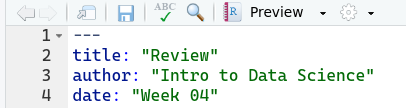

# Goals

- In the last three weeks, we have discussed a lot of new ideas/concepts.
- This week, I want to slow down and spend some time discussing what we've learned and why.
- Data visualization: ggplot
    - `ggplot(foo, aes(x = bar, y = baz)) +`
    - `geom_point()`
- Data transformation: dplyr
    - `filter()`
    - `group_by()`
    - `summarize()` | `count()`
    - `arrange`
- New ideas for tonight:
    - Long data v wide data
    - Create new columns: `mutate()`
    - Honestly, mostly review.

# Hans Rosling

If you've never heard of Hans Rosling, let me immediately correct that educational oversight. He recorded a number of terrific videos before passing in 2017. This video, which is only four minutes, is one of his best. The easiest way to view this video is to hit the `Preview` button at the top of the editor. This will render this notebook as an HTML file and will embed the YouTube video in-line.

```{r fig.align='center'}

```

<iframe width="560" height="315" src="https://www.youtube.com/embed/Z8t4k0Q8e8Y" frameborder="0" allow="accelerometer; autoplay; clipboard-write; encrypted-media; gyroscope; picture-in-picture" allowfullscreen></iframe>

# Setup

Run the code-chunk below to load everything you need for tonight's lecture.

```{r}
rm(list = ls()) ## Deletes anything you may have created earlier, freeing up RAM.
library(gapminder)
library(knitr)
library(tidyverse)

opts_chunk$set(echo = TRUE)

## This is the class survey data you've seen before.
survey <- read_csv("data/ClassSurvey.csv")
survey

## This is a subset of the data from the Gapminder presentation above.
data(gapminder)
gapminder

```


